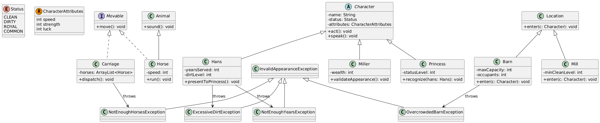

# Лабораторная работа №3–4: Объектная модель мира сказки про Ганса
# Вариант№ 107.8

---
>  А где твоя лошадь, Ганс? - спросили они.
>  Она будет здесь через три дня, - ответил Ганс.
> Через три дня? - засмеялись старшие ученики.
> Почему же не через три года? Что это за лошадь, которая плетется медленнее человека? Кто-то опять подшутил над тобой, дурачок!
> Мельник, увидев Ганса, рассердился.
> Как ты мог заявиться на мою чистую мельницу в своих грязных лох- мотьях? - закричал он. - Убирайся вон
> Ганс отправился жить в хлев.
> Три дня спустя, рано утром во двор мельницы въехала золотая карета, запряженная шестью резвыми лошадьми.
> Еще одна лошадь, привязанная сзади кареты, была красивее и статнее ос- тальных.
> На ней сидела необыкновенной красоты молодая принцесса.
> Мельник! - позвала она. Мельник выскочил ей навстречу, беспрестанно кланяясь. Он отродясь не видел такого богатства.
> Позови мне своего младшего ученика, великолепного Ганса, который служил у меня семь лет, - велела принцесса. <

## 1. Текст задания

В соответствии с выданным вариантом на основе предложенного текстового отрывка из литературного произведения создать объектную модель реального или воображаемого мира, описываемого данным текстом. Должны быть выделены основные персонажи и предметы со свойственным им состоянием и поведением. На основе модели написать программу на языке Java.

**Требования к объектной модели, сценарию и программе:**

- В модели должны быть представлены основные персонажи и предметы, описанные в исходном тексте. Они должны иметь необходимые атрибуты и характеристики (состояние) и уметь выполнять свойственные им действия (поведение), а также должны образовывать корректную иерархию наследования классов.
- Объектная модель должна реализовывать основные принципы ООП — инкапсуляцию, наследование и полиморфизм. Модель должна соответствовать принципам SOLID, быть расширяемой без глобального изменения структуры модели.
- Сценарий должен быть вариативным: при изменении начальных характеристик персонажей, предметов или окружающей среды их действия могут изменяться и отклоняться от базового сценария. Сценарий должен поддерживать элементы случайности.
- Объектная модель должна содержать как минимум один корректно использованный элемент каждого типа из списка:
  - абстрактный класс с абстрактным методом;
  - интерфейс;
  - перечисление (`enum`);
  - запись (`record`);
  - `ArrayList` для хранения однотипных объектов;
  - проверяемое исключение (`checked exception`).
- В классах персонажей и предметов должны быть переопределены `equals()`, `hashCode()`, `toString()`. В классах-исключениях — `getMessage()`.
- Все исключения должны быть использованы и обработаны. Также должно быть использовано и обработано хотя бы одно unchecked-исключение.

---

## 2. Диаграмма классов (текстовое UML-представление)

 

